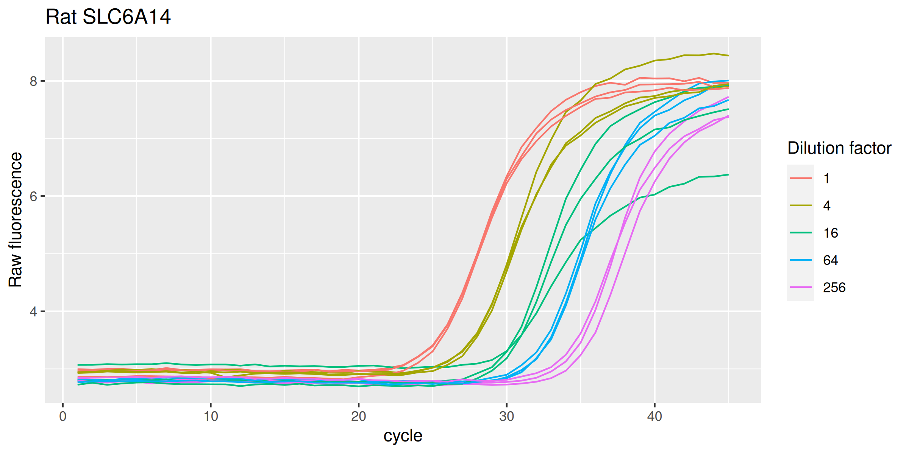
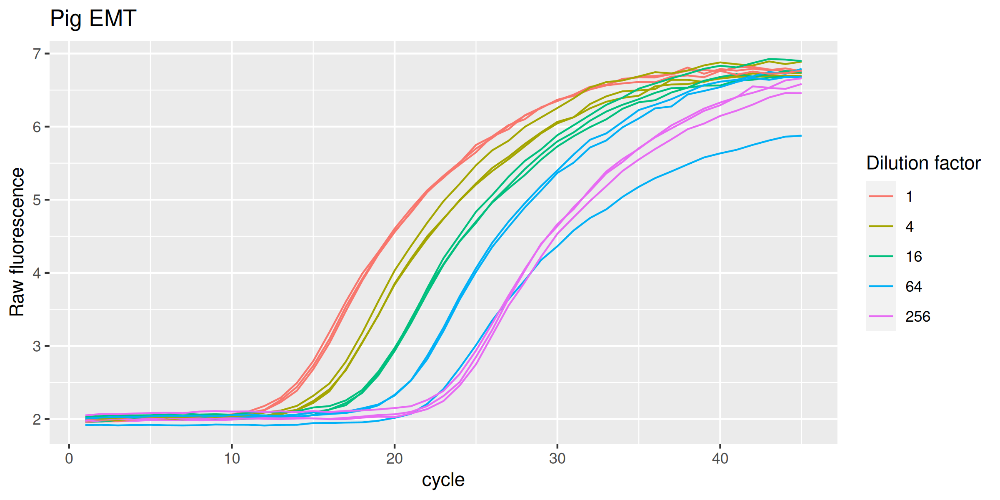
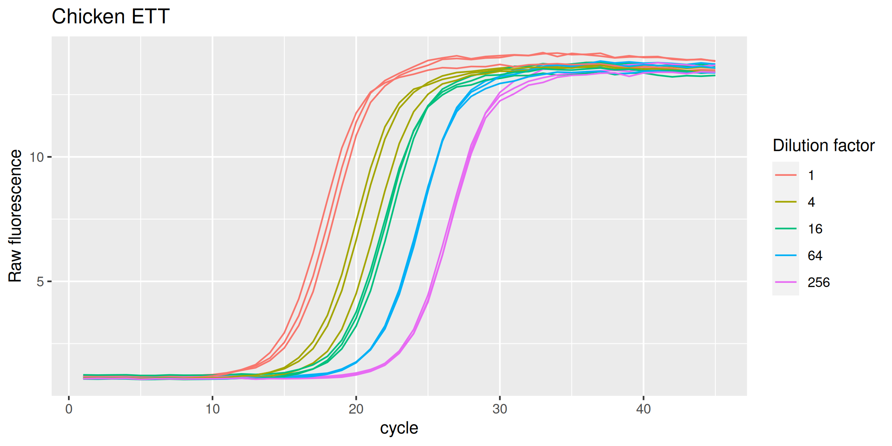
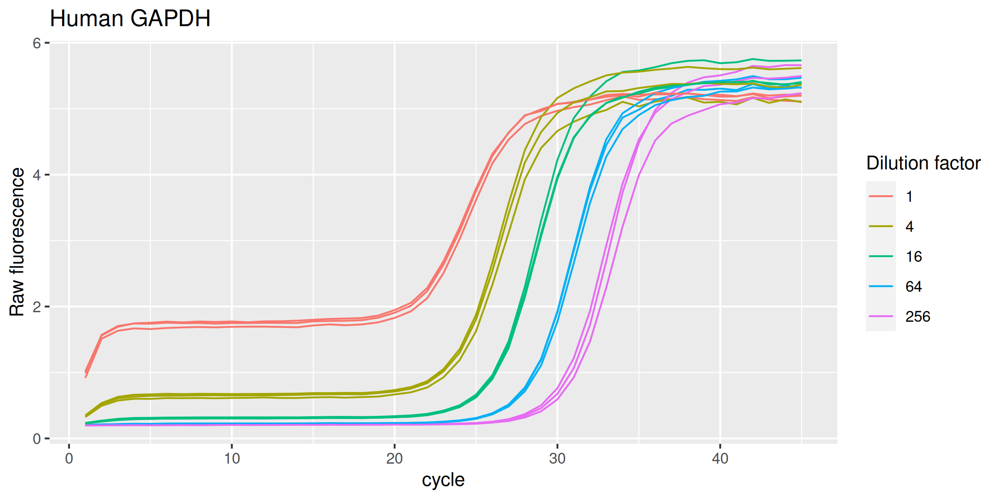

<!-- README.md is generated from README.Rmd. Please edit that file -->

# batsch

<!-- badges: start -->

[](https://CRAN.R-project.org/package=batsch)
<!-- badges: end -->

`{batsch}` provides real-time PCR data sets by Batsch et al. (2008) in
tidy format. There are five data sets bundled with this package, one for
each PCR target:

- `SLC6A14r` for *rat SLC6A14*
- `SLC22A13h` for *human SLC22A13*
- `EMTp` for *pig EMT*
- `ETTch` for *chicken ETT*
- `GAPDHh` for *human GAPDH*

Each data set comprises a five-point, four-fold dilution series. For
each concentration there are three replicates. Each amplification curve
is 45 cycles long.

## Installation

Install `{batsch}` from CRAN:

``` r
# Install from CRAN
install.packages("batsch")
```

You can instead install the development version of `{batsch}` from
GitHub:

``` r
# install.packages("remotes")
remotes::install_github("ramiromagno/batsch")
```

## Usage

### Rat SLC6A14

``` r
library(batsch)

SLC6A14r %>%
  ggplot(mapping = aes(
    x = cycle,
    y = fluor,
    group = interaction(dilution, replicate),
    col = as.factor(dilution)
  )) +
  geom_line(linewidth = 0.5) +
  labs(y = "Raw fluorescence", colour = "Dilution factor", title = "Rat SLC6A14") +
  guides(color = guide_legend(override.aes = list(size = 0.5)))
```



### Human SLC22A13

``` r
SLC22A13h %>%
  ggplot(mapping = aes(
    x = cycle,
    y = fluor,
    group = interaction(dilution, replicate),
    col = as.factor(dilution)
  )) +
  geom_line(linewidth = 0.5) +
  labs(y = "Raw fluorescence", colour = "Dilution factor", title = "Human SLC22A13") +
  guides(color = guide_legend(override.aes = list(size = 0.5)))
```


### Pig EMT

``` r
EMTp %>%
  ggplot(mapping = aes(
    x = cycle,
    y = fluor,
    group = interaction(dilution, replicate),
    col = as.factor(dilution)
  )) +
  geom_line(linewidth = 0.5) +
  labs(y = "Raw fluorescence", colour = "Dilution factor", title = "Pig EMT") +
  guides(color = guide_legend(override.aes = list(size = 0.5)))
```



### Chicken ETT

``` r
ETTch %>%
  ggplot(mapping = aes(
    x = cycle,
    y = fluor,
    group = interaction(dilution, replicate),
    col = as.factor(dilution)
  )) +
  geom_line(linewidth = 0.5) +
  labs(y = "Raw fluorescence", colour = "Dilution factor", title = "Chicken ETT") +
  guides(color = guide_legend(override.aes = list(size = 0.5)))
```



### Human GAPDH

``` r
GAPDHh %>%
  ggplot(mapping = aes(
    x = cycle,
    y = fluor,
    group = interaction(dilution, replicate),
    col = as.factor(dilution)
  )) +
  geom_line(linewidth = 0.5) +
  labs(y = "Raw fluorescence", colour = "Dilution factor", title = "Human GAPDH") +
  guides(color = guide_legend(override.aes = list(size = 0.5)))
```



## Code of Conduct

Please note that the `{batsch}` project is released with a [Contributor
Code of
Conduct](https://contributor-covenant.org/version/2/1/CODE_OF_CONDUCT.html).
By contributing to this project, you agree to abide by its terms.

## References

- Anke Batsch, Andrea Noetel, Christian Fork, Anita Urban, Daliborka
  Lazic, Tina Lucas, Julia Pietsch, Andreas Lazar, Edgar Schömig & Dirk
  Gründemann. *Simultaneous fitting of real-time PCR data with
  efficiency of amplification modeled as Gaussian function of target
  fluorescence*. BMC Bioinformatics 9:95 (2008). doi:
  [10.1186/1471-2105-9-95](https://doi.org/10.1186/1471-2105-9-95).
